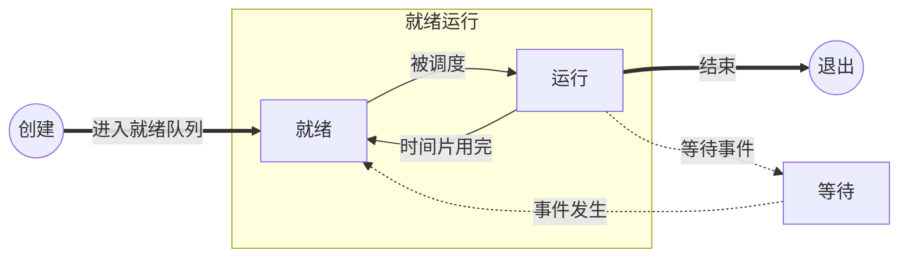

继承多道批处理操作系统，必然会出现多进程的操作系统。
# 定义
一个具有一定独立功能的程序在一个数据集合上的一次动态执行过程。也成为任务task
其他术语：
task process在操作系统语义下是一个意思。
job作业是围绕一个共同目标的一组进程整体。更倾向于业务逻辑。
## 特点
- 动态性
- 并发性
- 有限度的独立性，进程之间不用感知对方的存在。

> 基本考点：进程与程序的区别

## 进程状态
### PCB（process control block)
任务控制块，操作系统维护进程数据的核心数据结构
可能存什么值？

| key | value |
| --- | ----- |
| PC  |       |
| SP  | 栈顶指针  |
| PID | 进程ID  |
## 模型

# 调度方式：
## 协作式调度(cooperative scheduling)
- 进程主动放弃
- 操作系统不打断
- 操作系统选择下一个进程执行
## 分时多任务抢占（preemptive scheduling)
- 操作系统按照时间片轮流执行
- 进程被动的放弃处理器使用
- 操作系统选择下一个进程执行
