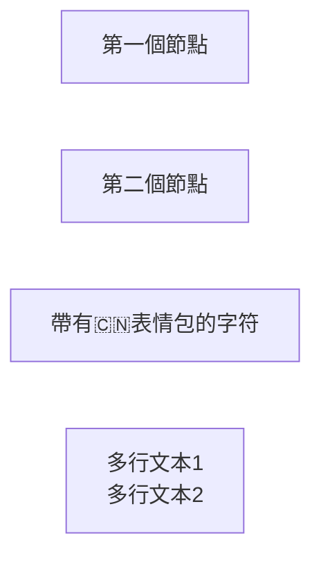
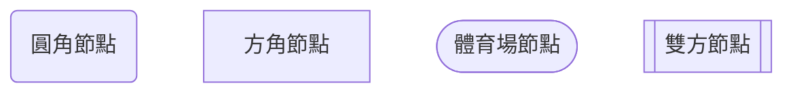
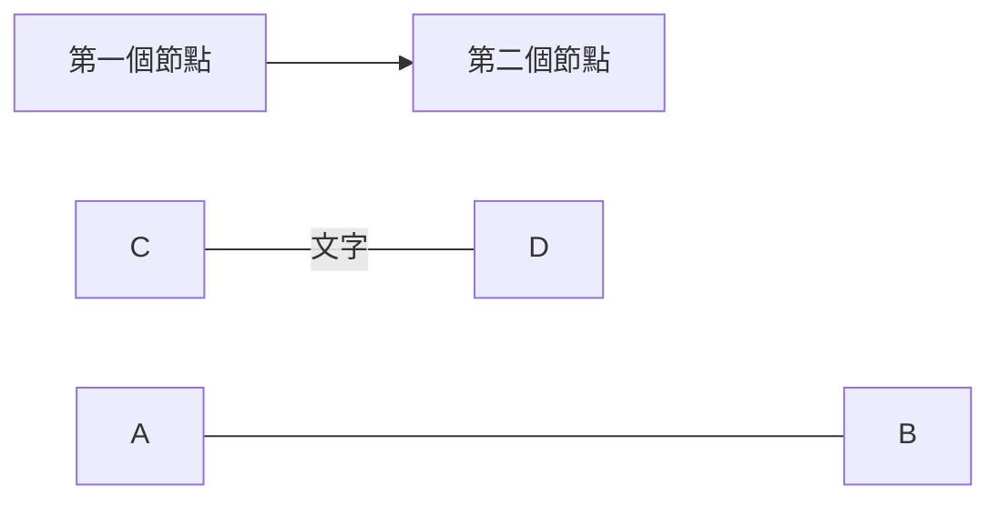
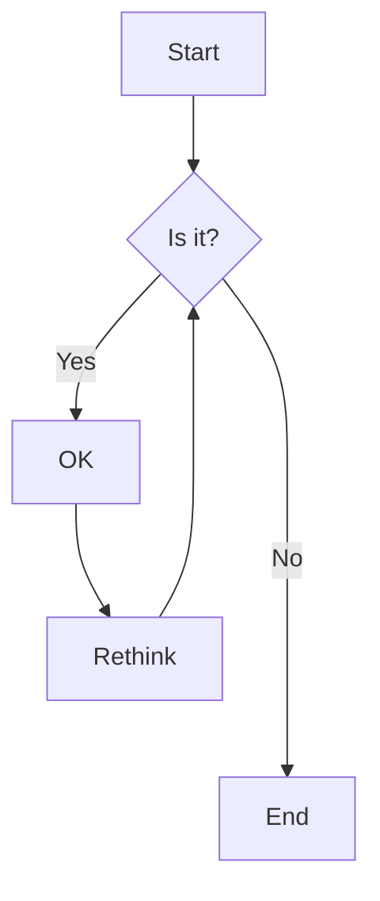
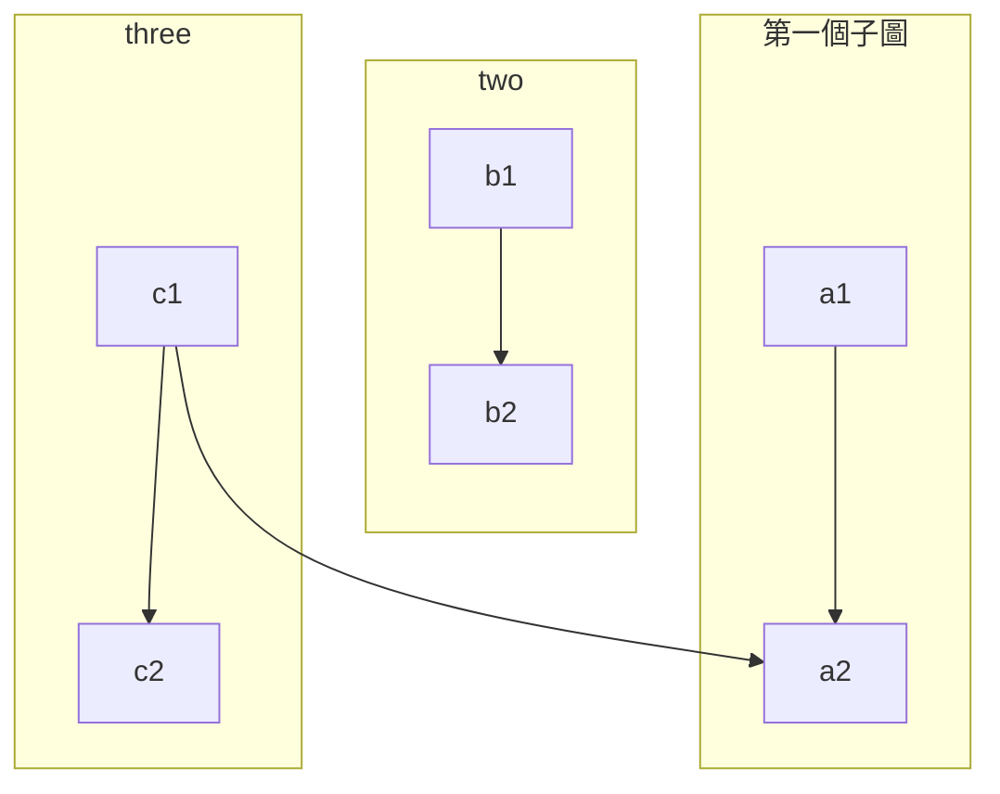
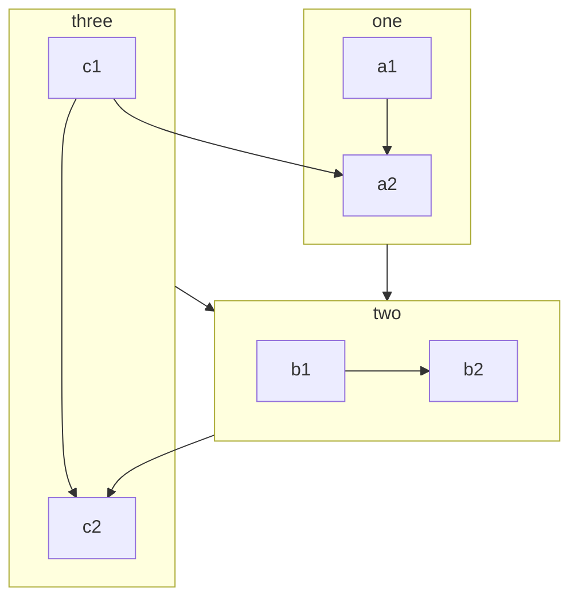

[官方](https://mermaid.js.org/)

由flowchart或者graph開始

# 節點內部的文字與id

# 節點樣式

# 連接

# 箭頭樣式

| 长度     | 1      | 2       | 3        |
| ------ | ------ | ------- | -------- |
| 普通的    | `---`  | `----`  | `-----`  |
| 带箭头的正常 | `-->`  | `--->`  | `---->`  |
| 厚的     | `===`  | `====`  | `=====`  |
| 带箭头的粗体 | `==>`  | `===>`  | `====>`  |
| 虚线     | `-.-`  | `-..-`  | `-...-`  |
| 带箭头的虚线 | `-.->` | `-..->` | `-...->` |

例子

# 子圖
使用direction來表示方向

子圖也可以有邊

