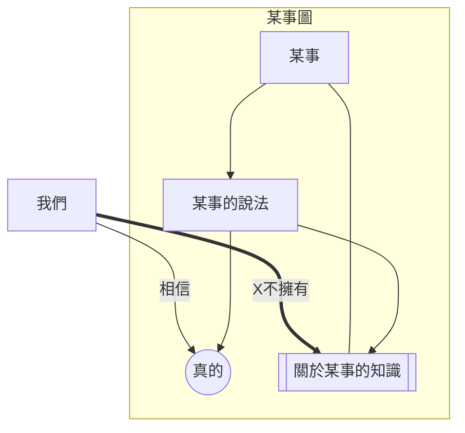
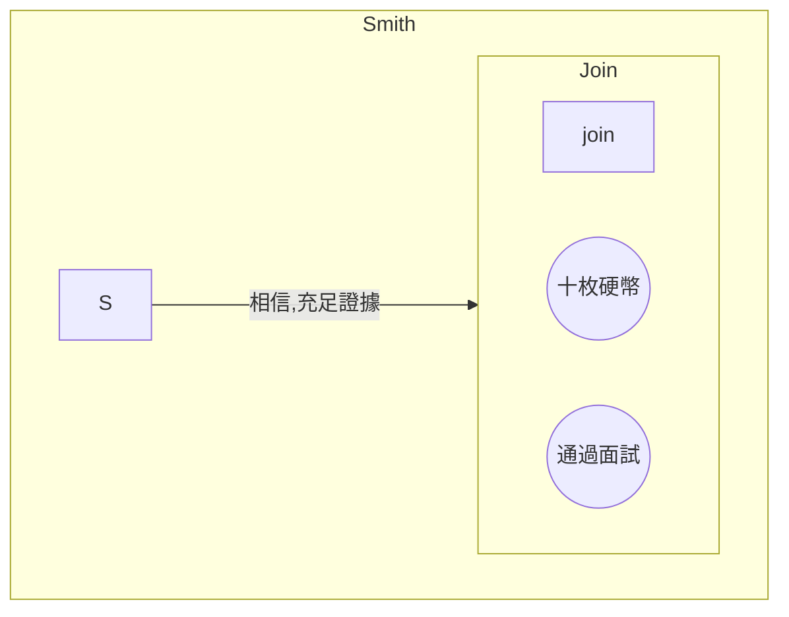
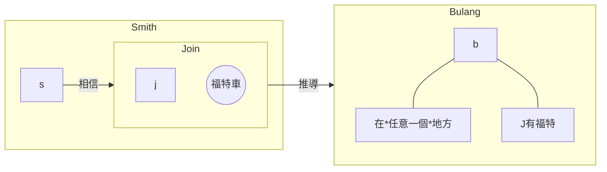
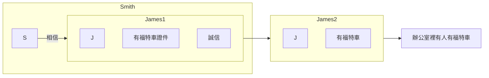

# 三條件說

## 定義

1. 知道什麼（knowing that）：
有真有假的命題，數理邏輯意義的，就是**命題知識**
2. 知道如何做（knowing how）：
實踐的知識，會游泳，會騎車等等
3. 親知（knowledge by acquaintance）：
體驗的感受。我很熟悉北京

## 反駁

知道如何做也是知道什麼。人工智能只知道什麼，但是它們知道如何做。知道如何做不是重要的，本質的。

## 命題知識

我們主要研究命題知識

### 特點

 1. 認知主體與對象之間的中介
 2. 知識可傳達
 3. 有真假

# 西方對知識的認識

## Theaeteus

知識是真的信念

相信某事的知識，不能說擁有了某事的知識。因為可能是蒙的

## 加入證明

某人S知道命題P，當且僅當：
1. P is true 【客觀條件】
2. S believes that P is true 【主觀條件】
3. S is justified in believe that P is true 【辯護條件】

他們肯定是必要條件，證明：
對於1：
S知道P表示P一定是真的。我們不會說錯誤的知道。
對於2：
我們不會說我知道P，但是不相P。知識只是信念的一種，真的信念才是知識。
對於3：
否則，蒙的東西也可能是知識。但是它不應該是知識。

## Gettier的挑戰

### 例證1

> 這個例子有疑問，看起來蘊含關係搞錯了 2024.10.1

### 例證2

但是，可能壓根Join就沒有福特，而且巧合的是，布朗真的在史密斯蒙的那個地方。
這樣，Bulang中的那個析取命題：Join有福特車且Bulang在巴塞羅納就是真的。但是，smith既不知道join沒有福特車，也不知道Bulang就在巴塞羅納。

### 反例形式化

- S相信P
- S相信P可以辯護
- S由P推出Q，相信Q
- P蘊含Q；P可以推出Q
- P使得S相信Q是可以得到辯護的。
- P為假，
- Q為真
- S相信Q是可以得到辯護的，但S不知道Q

### 構造反例的原則

1. S得到辯護地相信的命題可能為假。【P可能為假】
2. 假的語句可以提供辯護。【P可以提供辯護】
3. 辯護傳遞性。【P推出Q，Q也是由辯護的】

## 對挑戰的反駁

反駁原則2，假的語句不能提供辯護

但是，James沒有福特車，辦公室裡恰巧有個其他人有福特車。
James有福特車是假的，S也不知道辦公室裡有人有福特車。假的命題不能提供辯護。

## 再反駁

將James有福特車改為辦公室裡有人告訴Smith他有一輛福特車，並且他誠實可靠；那麼，就可以推出Smith相信辦公室裡有人有福特車。