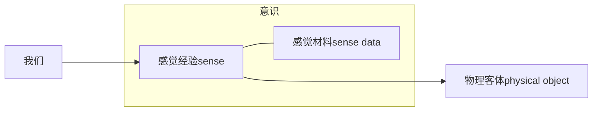

# 问题的提出

## 引入

为什么我们需要怀疑？知识需要质疑，需要验证,我们才敢肯定它是对的。感官就是真的吗？看到的就是真的吗？经验在任何时候都可以靠得住吗？

我们通过感觉经验，感知物理客体，在自己的意识中得到感知到的感觉材料。

意识和物理世界的对应
- 感觉经验就是客观世界 吗？
- 感觉经验的性质就是客观世界真实的性质 吗?
- 如果有“桌子”，感觉经验内容——感觉材料与物理客体的关系是什么？
存在物理世界吗
- 存在 吗？
**我们能否拥有我们心灵之外的东西？我们怎么知道外界世界是存在的?**

## 怀疑主义

### 全面怀疑主义
强式：否定一切知识。
弱式：否定我们拥有的知识，但不排除拥有的可能
### 局部怀疑主义
怀疑某些特定的领域，与那些领域证明或者论证方式有关

# 笛卡尔的反驳
走怀疑主义的路，让怀疑主义无路可走
## 笛卡尔的策略
> 和我认为显然是错误的东西一样，对于那些不是完全确定无疑的东西也应该不要相信。
> 实用态度和理论态度

我们对一个命题的真假（the truth of statement），有四种态度：
- 相信它是真的
- 相信它是假的
- 相信没有可能确定它的真假
- 不置可否（to suspend judgment)
> 例如：对于上帝是否存在：
> 有神论者
> 无神论者
> 不可知论者
> 不置可否

对于不确定的信念，笛卡尔不置可否。
## 笛卡尔的实施
不怀疑一切具体的信念，而是考虑他们的抽象的，基础的原则。比如感知基础。
就是我们前面说的**感知经验**

笛卡尔现在正式开始怀疑感知经验。他开始证明感知经验不可靠，以此来证明怀疑主义。
### 感觉论证（sense argument）
眼见就一定为实吗？
- 我大部分信念建立在感觉之上
- 这些感觉经验曾经欺骗过我
- 对曾经欺骗过我的感觉经验的怀疑是合理的
- 我怀疑其他的感觉经验
但是，它不能证明**怀疑主义的普遍性**。这只是一些感觉经验的欺骗，而且感觉经验根观察条件有关。
### 梦之论证（dream argument）
- 不存在区分梦和现实的标准
- 我可能在梦里
- 梦里的经验通常都是假的
- 我的感觉经验可能是假的
- 我对世界的信念建立在感觉经验上
- 我对世界的信念可能是假的
第一个前提可能就不对，梦里的东西没有逻辑，不连贯
梦里，人类的逻辑也是存在的。数学先验知识也是成立的。不能反驳所有的知识。
### 恶魔论证（demon argument）
- 有可能存在一个万能的恶魔
- 它骗我
- 那我的知识就是错的
## 笛卡尔的反驳

**I am thinking,thereforce I am**

笛卡尔找到那个一定无法被怀疑的命题，就是怀疑活动本身——“思考中的我”Cogito。
如果这都被怀疑，那怀疑本身都不复存在。
就算我怀疑我的存在，那也是我在怀疑，那恰恰就说明我的存在无可怀疑，因为我在怀疑。
